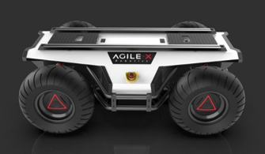
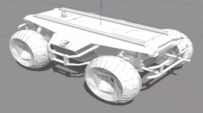

# Reinforcement Learning-based Navigation for Autonoumous Robot

## Table of Contents  
- [Table of contents](#table-of-contents)  
- [Objectives](#objectives)  
- [Setup](#setup)  
- [Simulation of world](#simulation-of-world)  
- [Robot model](#robot-model)  
- [Object detection by LIDAR](#object-detection-by-LIDAR)  
- [Navigation based on RL(PPO)](#navigation-based-on-RL(PPO))  

## Description  
- Create a simulation environment.
- Detect obstacles by LIDAR and acquire ego location by GPS.
- Train the robot to find destination by itself.

## Setup  

## Simulation of world  
- the description of simulated world [/scout/gazebo/worlds/](./scout/gazebo/worlds/)  
- launch file to start the environment [/scout/gazebo/launch/](./scout/gazebo/launch/)  
`roslaunch scout based.launch`

## Robot model
The robot's name is scout, which is provided by AgileX Robotics.  
  
- [robot model](./scout/description/)   
   - joints and links definition  
   - physical appearance  
   - sensor plug  
  

## Object detection by LIDAR  
- use plc to process LIDAR data, provided in [(/vlp_fir)](./vlp_fir/)  
- use rviz to show detection result, launch files are provided in [/scout/description/launch/](./scout/description/launch/)  
  

## Navigation based on RL(PPO)  
- robot is trained to avoid obstacles and reach the goal area (green area).  
- provided three strategies to train the robot [/scout/src/](./scout/src/)   
   - based strategy: fixed goal.  
  
   - random goal strategy - random goal.  
   - disturb strategy - simulated low-price GPS by add random noise in odom.
